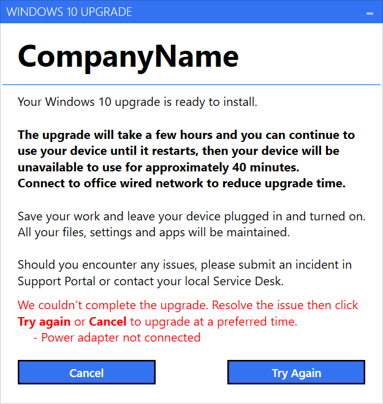
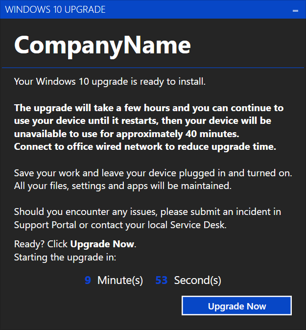

# Windows Upgrade Assistant (WUA)

Windows upgrade assistant (WUA) allows to display a notification to the end user that can be used to describe about the Windows 10 upgrade for the user to take the required action. The tool can perform pre-upgrade checks to ensure they are met before proceeding with the upgrade. User can fix them and try again or can cancel the deployment. If the user does not take an action, it auto closes the script and fails the deployment. If all the pre-requisites are met, a button to upgrade will appear to start the upgrade immediately or will appear after a defined amount of time which is displayed as a countdown. The tool proceeds automatically when the prerequires are met and countdown time goes zero. WUA also detects the network connection type and has the capability to display different text or buttons based on the type.

The tool needs to be called as a part of the Windows 10 upgrade SCCM task sequence usually at the start of the task sequence. For task sequences ServiceUI.exe must be used to display the GUI in interactive model as task sequences run under system content. 

WUA is written in PowerShell using WPF and Mahapps framework.
Mahapps brings Metro style interface to WPF applications. (https://mahapps.com/)

### Features
* Add custom company logo/text
* Customize button text, display text and overall look and feel
* Display different text based on the connection type (e.g Notify user that the upgrade takes 2 hours on VPN where as 40 mins on LAN)
* Display Cancel button only for VPN but not on Wireless or LAN giving the flexibility to user to cancel the upgrade if on a hotspot connection instead of forcing the upgrade
* Pre-requisite checks: Currenly Power adapter connection and Free Disk space check but it can customized to add more checks.
* Customize the timer (e.g Wait for 60 minutes before the upgrade starts)
* Customize the timer based on if the task sequence deployed as mandatory or available (e.g display 5 mins when the user initiates the deployment from software center or 60 mins if it auto triggers). Note: this needs to be done within the task sequence by running the same script based on the built in task sequence variable _SMSTSUserStarted

### Script Parameters
1. TimerDuration - Displays the countdown after which the upgrade starts. (Default: 10 minutes)
2. AutoCloseDuration - Time in minutes after which the application auto closes and exits (Default: 60 minutes)
3. LogFile - By default the log file is created under C:\Logs

### Code Structure
* assembly\ and resources\ - contains Mahapps binaries
* ErrorCodes.csv - Format: ErroCode, ErrorMessage
Contains the pre-requiste check error codes and the text to be disaplyed in the form. The script will fail with these error codes which are returned to the task sequence that help to identify if the upgrade was cancelled and if it was due to a pre-requisite failure. When a new pre-requisite check funtion is added the respective error codes and the error messages must be added in this file. The starting error code is 10000. The pre-requisite error codes are added to 10000 (e.g 10001 - Power adapter check failure)
* WindowsUpgradeAssistant.ps1 - Contains all the logic of the tool 
* WindowsUpgradeAssistant.xaml - Contains the formatting and the look and feel of the form defined in XAML. 

Light theme  (Pre-reqs not met)        |  Dark theme
:-------------------------:|:-------------------------:
 | 
